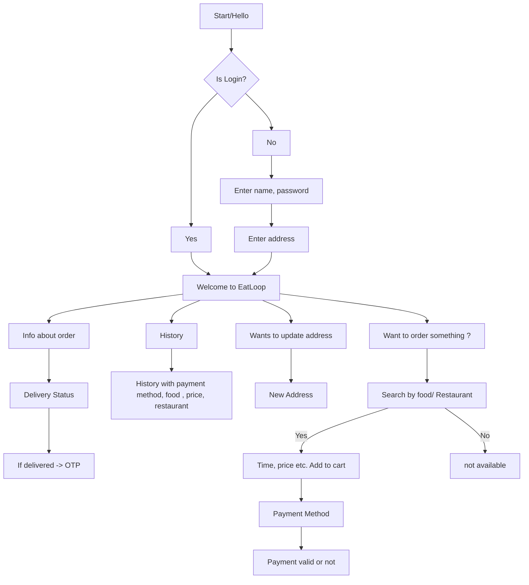

# User FlowChart



# Restaurant FlowChart

```mermaid
graph TD;
    A[Start/Hello] --> B{Is Registered?};
    B --> Z[Yes] --> I
    B --> Y[No]
    Y --> G[Verified Yourself];

    G --> I[Welcome to EatLoop]

    I --> E[History]
    E --> c[1 day history]
    E --> d[Complete history]

    I --> F[Wants to update menu]
    F --> Q[Add food, price etc]
    F --> R[Delete food/Change price etc]

    I --> J[Orders Status]
    J --> K[Order Pending] --> M[List of orders]
    M --> O[Accept/Reject] --> P[Notification to eatloop]
    J --> L[Order Delivered] --> N[history and feed back]
    J --> S[Order ready for Delivered] --> H[OTP for eatloop and delivery person]


